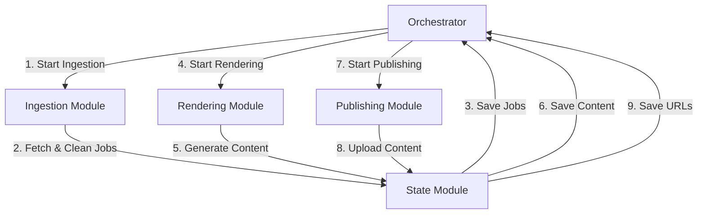

# Proposed Architecture for JobAgent247 (Revised)

This document outlines a new, modular monolith architecture for the JobAgent247 repository, designed for simplicity, reliability, and zero-cost deployment on GitHub Actions.

## 1. Architecture: Modular Monolith

We will refactor the existing codebase into a modular monolith. This approach maintains a single codebase and runtime while organizing the application into distinct, loosely coupled modules. This design avoids the complexity of distributed systems and is ideal for the project's scale and deployment target.

### 1.1. Core Modules

The application will be structured around the following core modules:

- **`orchestrator`:** The central module that manages the entire workflow, from data ingestion to content generation and publishing.
- **`ingestion`:** A module responsible for fetching and processing data from external sources (e.g., Adzuna).
- **`state`:** A module for managing the application's state using lightweight solutions like JSON files or a local SQLite database.
- **`rendering`:** A module for generating content (images, videos, PDFs) from data using reusable templates.
- **`publishing`:** A module for uploading content to various platforms (e.g., Instagram, YouTube).

### 1.2. Workflow

The workflow will be managed by the `orchestrator` and will proceed in a series of steps. The communication between modules will be through direct function calls. For handling failures and retries, we will implement a simple, file-based or SQLite-based retry queue within the `state` module.

**Workflow Steps:**

1.  The **Orchestrator** initiates the ingestion process.
2.  The **Ingestion Module** fetches and cleans the job data.
3.  The cleaned data is saved to the **State Module**.
4.  The **Orchestrator** triggers the **Rendering Module**.
5.  The **Rendering Module** generates content and saves it via the **State Module**.
6.  The **Orchestrator** triggers the **Publishing Module**.
7.  The **Publishing Module** uploads the content and saves the public URLs via the **State Module**.

## 2. Phased Implementation

The project will be implemented in progressive phases to ensure a stable and reliable foundation.

### Phase 1: Stable Ingestion Pipeline

The first phase will focus exclusively on creating a robust data ingestion pipeline.

**Scope of Phase 1:**

- **Fetch Jobs:** Implement the logic to fetch jobs from the Adzuna API.
- **Clean and Normalize Jobs:** Implement data cleaning, normalization, and categorization logic.
- **Save State:** Implement the state management module to save the processed job data to a local JSON file or SQLite database.

**Out of Scope for Phase 1:**

- YouTube automation
- Instagram publishing
- AI hooks
- Analytics
- PDF generation
- Video rendering

This phased approach will allow us to build and test the core data processing functionality before adding more complex features.
