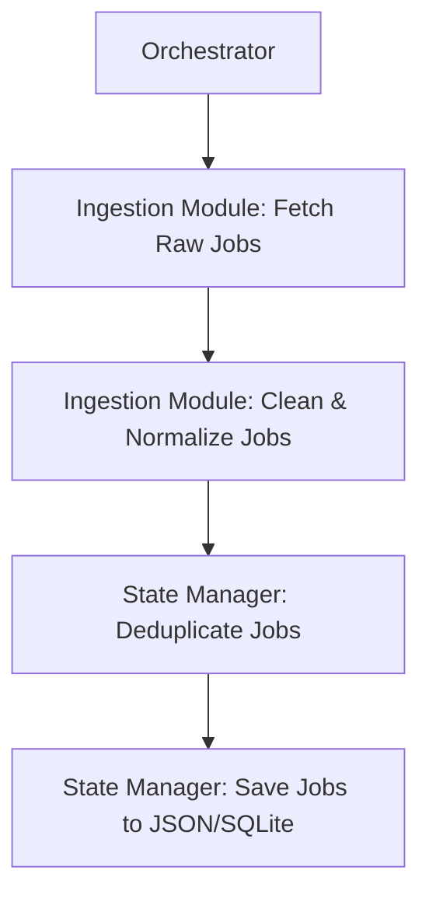

# Phase 1 Implementation Plan: Stable Ingestion Pipeline

This document details the implementation plan for Phase 1 of the JobAgent247 modular monolith. The goal of this phase is to build a stable and reliable data ingestion pipeline.

## 1. Implementation Plan

The implementation will be carried out in the following steps:

1.  **Create Modular Folder Structure:** Establish the new directory structure for the modular monolith.
2.  **Implement Centralized Logging:** Create a shared logging utility.
3.  **Implement Shared Job Model:** Define a central data structure for a "Job".
4.  **Implement State Manager:** Create the state management module for saving and loading job data, including a mechanism for deduplication.
5.  **Implement Ingestion Module:** Develop the module responsible for fetching data from Adzuna, with retry-safe fetching and cleaning utilities.
6.  **Implement Orchestrator:** Create the main entry point for the application to manage the ingestion workflow.
7.  **Write Unit Tests:** Add unit tests for the new modules to ensure their reliability.

## 2. Folder Structure

The project will be reorganized into a modular monolith structure within a new `jobagent247` directory. This structure promotes a clear separation of concerns.

```
jobagent247/
├── __init__.py
├── orchestrator.py         # Main entry point and workflow manager
├── ingestion/
│   ├── __init__.py
│   ├── adzuna.py           # Adzuna API client and fetching logic
│   └── cleaning.py         # Data cleaning and normalization utilities
├── state/
│   ├── __init__.py
│   ├── db.py               # State management (JSON/SQLite) and deduplication
│   └── models.py           # Shared data models (e.g., Job)
└── utils/
    ├── __init__.py
    └── logging.py          # Centralized logging utility
tests/
├── __init__.py
├── ingestion/
│   ├── __init__.py
│   └── test_cleaning.py
└── state/
    ├── __init__.py
    └── test_db.py
```

## 3. Data Flow

The data flow for the ingestion pipeline is linear and straightforward:

1.  The **Orchestrator** starts the process.
2.  It calls the **Ingestion Module** to fetch raw job data from the Adzuna API.
3.  The raw data is then passed to the cleaning utilities within the **Ingestion Module** to be normalized and categorized.
4.  The cleaned list of jobs is passed to the **State Manager**.
5.  The **State Manager** performs deduplication against the existing job data.
6.  The final, deduplicated list of jobs is saved to a JSON file or a SQLite database.



## 4. State Management Strategy

The state will be managed using a local JSON file (`data/jobs.json`) for simplicity and zero-cost deployment. A SQLite database is a viable alternative if the state management needs become more complex.

**Deduplication:**

To prevent duplicate job postings, a deduplication mechanism will be implemented in the `state` module. When new jobs are fetched, they will be compared against the jobs already present in the state file. A unique identifier for each job will be created (e.g., a hash of the job title, company, and location) to perform the comparison. Only new, unique jobs will be added to the state.

## 5. Shared Job Model

To ensure consistency and avoid code duplication, we will create a single, canonical `Job` model in `jobagent247/state/models.py`. This model will be used across all modules of the application.

**Key Features:**

-   **Centralized Schema:** A single source of truth for the job data structure.
-   **Validation:** Centralized validation logic to ensure data integrity.
-   **Serialization:** A consistent way to serialize and deserialize job data.

This refactoring will remove duplicated parsing logic from the existing `designer.py`, `pdf_generator.py`, and `video_maker.py` files and ensure that all parts of the application work with the same data structure.

